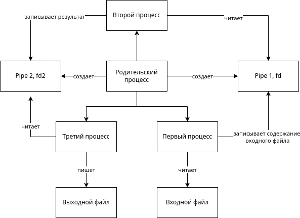
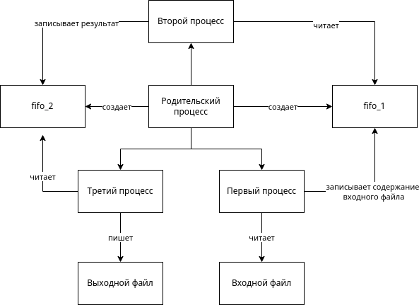
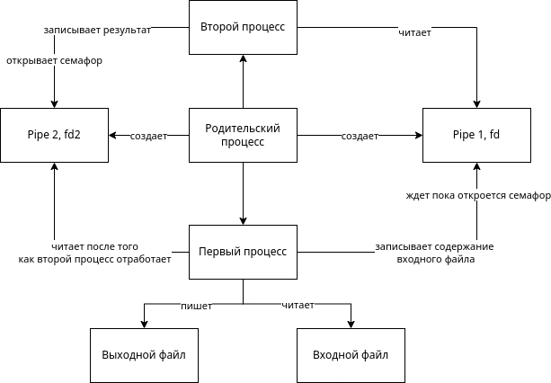
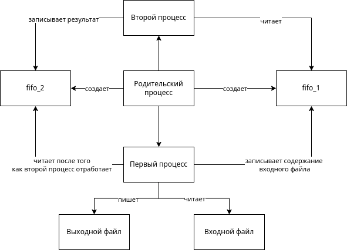
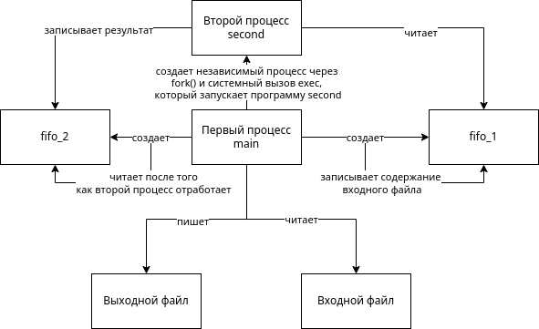

# Отчет по ИДЗ №1 по ОС

## Харитонов Кирилл Александрович БПИ214

## Вариант 32

### Условие задачи

Разработать программу, которая на основе анализа двух входных
ASCII-строк формирует на выходе две другие строки. В первой из
выводимых строк содержатся символы, которых нет во второй исходной строке. Во второй выводимой строке содержатся
символы,
отсутствующие в первой входной строке (разности символов).
Каждый символ в соответствующей выходной строке должен встречаться только один раз.
    
## 4 балла
### Схема

Тесты и их результаты в папке grade_4/tests

Код в файле grade_4/main.c

Скрипт для компиляции и прогона тестов в grade_4/Makefile

Скомпилированная программа в grade_4/main

## 5 баллов
### Схема

Тесты и их результаты в папке grade_5/tests

Код в файле grade_5/main.c

Скрипт для компиляции и прогона тестов в grade_5/Makefile

Скомпилированная программа в grade_5/main

## 6 баллов
### Схема

Тесты и их результаты в папке grade_6/tests

Код в файле grade_6/main.c

Скрипт для компиляции и прогона тестов в grade_6/Makefile

Скомпилированная программа в grade_6/main

## 7 баллов
### Схема

Тесты и их результаты в папке grade_7/tests

Код в файле grade_7/main.c

Скрипт для компиляции и прогона тестов в grade_7/Makefile

Скомпилированная программа в grade_7/main

## 8 баллов
### Схема

Тесты и их результаты в папке grade_8/tests

Код в файле grade_8/main.c и grade_8/second.c

Скрипт для компиляции и прогона тестов в grade_8/Makefile

Скомпилированная программа в grade_8/main и grade_8/second
